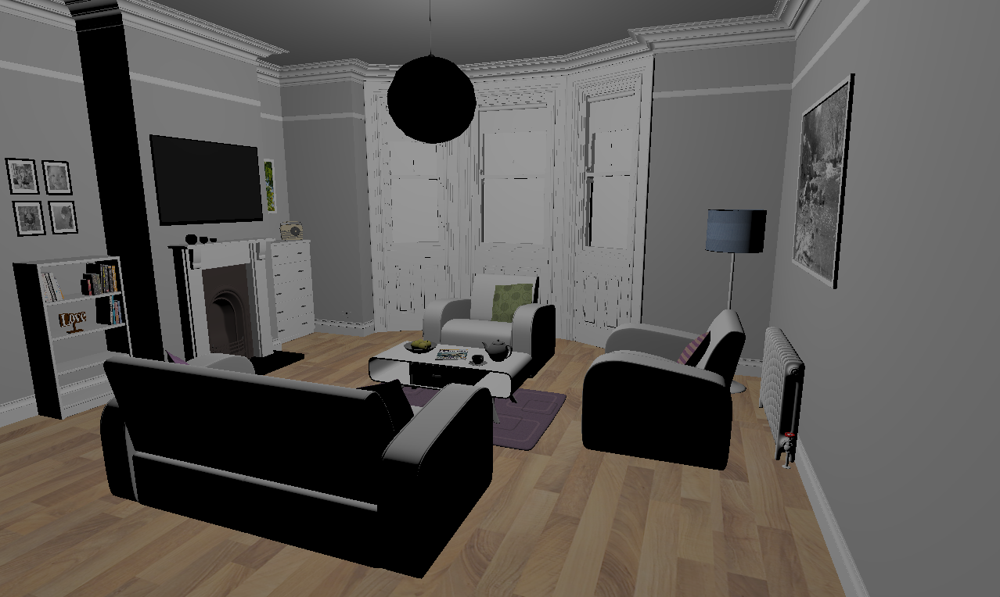
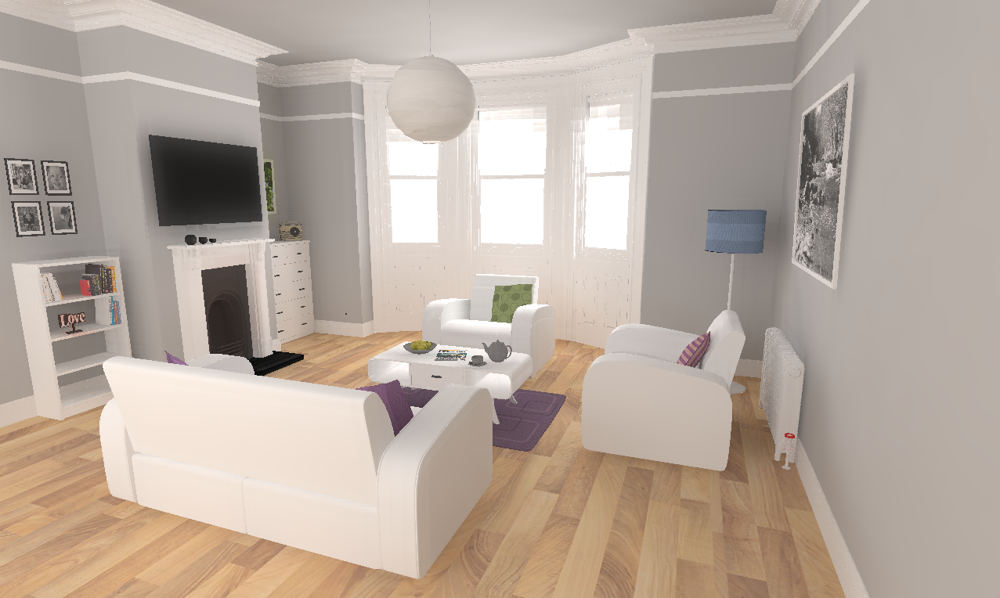

# RayTracing_Vulkan

A Custom Rendering Engine built with C, VulkanAPI, and ImGui.

**Note:** This project is built and test on Visual Studio 2022.

## Project Objectives
1. Implement Monte-Carlo Path Tracing Algorithm using Probability Distribution Function Theory.
2. Compute History Tracking for each frame using Selective Weighted Bi-linear Interpolation Method.
3. Implement edge-avoiding A-Trous algorithm using Computer Shader.

### Scanlines

### Ray-Tracing (with Noise)

### RayTracing (with Denoiser)

